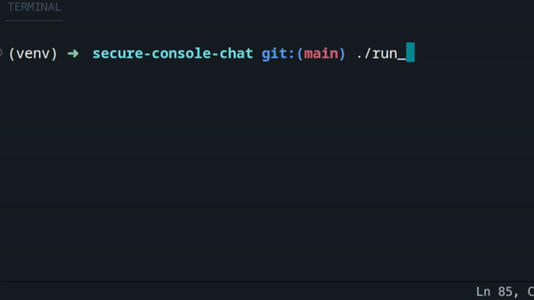

<div align="center">

# 🤐 CMD-CHAT

### encrypted terminal chat. no servers. no logs. ram only.

[](https://opensource.org/licenses/MIT)
[](https://www.python.org/downloads/)

</div>

---

peer-to-peer encrypted chat that runs in your terminal. you host, you control. close the window — everything's gone.

## why

every "secure" messenger still stores metadata somewhere. this doesn't. it's just two terminals talking over an encrypted tunnel. nothing written to disk, ever.

## how it works

```
┌──────────────────────────────────────────────────────────────────┐
│                        SRP AUTHENTICATION                        │
├──────────────────────────────────────────────────────────────────┤
│                                                                  │
│  CLIENT                                         SERVER           │
│    │                                              │              │
│    │─────── POST /srp/init {username, A} ───────► │              │
│    │         (A = client public ephemeral)        │              │
│    │                                              │              │
│    │◄──── {user_id, B, salt, room_salt} ───────── │              │
│    │         (B = server public ephemeral)        │              │
│    │         (room_salt = E2E key derivation)     │              │
│    │                                              │              │
│    │  [client derives room_key via HKDF:          │              │
│    │   room_key = HKDF(password, room_salt)]      │              │
│    │                                              │              │
│    │  [both sides compute SRP session key         │              │
│    │   using password + ephemeral values]         │              │
│    │                                              │              │
│    │─────── POST /srp/verify {user_id, M} ──────► │              │
│    │         (M = client proof)                   │              │
│    │                                              │              │
│    │◄────────── {H_AMK, session_key} ──────────── │              │
│    │         (H_AMK = server proof)               │              │
│    │                                              │              │
│    │  [password never transmitted]                │              │
│    │  [MITM can't derive session key]             │              │
│    │                                              │              │
├──────────────────────────────────────────────────────────────────┤
│                      E2E ENCRYPTED CHAT                          │
├──────────────────────────────────────────────────────────────────┤
│    │                                              │              │
│    │═══════ WebSocket /ws/chat?user_id ═════════► │              │
│    │         (authenticated session)              │              │
│    │                                              │              │
│    │                                              │              │
│  ┌─┴─┐                                        ┌──┴──┐            │
│  │ C │──── encrypt(msg, room_key) ───────────►│  S  │            │
│  │ L │                                        │  E  │            │
│  │ I │◄─── ciphertext (broadcast) ────────────│  R  │            │
│  │ E │                                        │  V  │            │
│  │ N │     decrypt(ciphertext, room_key)      │  E  │            │
│  │ T │                                        │  R  │            │
│  └─┬─┘                                        └──┬──┘            │
│    │                                              │              │
│    │  [server stores ONLY ciphertext]             │              │
│    │  [server CANNOT read messages]               │              │
│    │  [all clients with same password             │              │
│    │   derive identical room_key]                 │              │
│    │                                              │              │
│    │  Encryption: Fernet (AES-128-CBC + HMAC)     │              │
│    │  Key derivation: HKDF-SHA256                 │              │
│    │                                              │              │
│    │  [on disconnect: keys wiped from RAM]        │              │
│    │                                              │              │
└──────────────────────────────────────────────────────────────────┘

┌──────────────────────────────────────────────────────────────────┐
│                      KEY HIERARCHY                               │
├──────────────────────────────────────────────────────────────────┤
│                                                                  │
│  password ──┬──► SRP ──► session_key (per-user, auth only)       │
│             │                                                    │
│             └──► HKDF(password, room_salt) ──► room_key (shared) │
│                                                                  │
│  room_salt: generated once at server start                       │
│  room_key:  deterministic, same for all clients with same pwd    │
│                                                                  │
└──────────────────────────────────────────────────────────────────┘
```

**SRP (Secure Remote Password)** — password is never sent over the network. both sides prove they know it via zero-knowledge proof, then derive identical session keys.

## install

```bash
python -m venv venv && source venv/bin/activate && pip install -r requirements.txt
```

windows:

```bash
python -m venv venv ; .\venv\Scripts\activate ; pip install -r requirements.txt
```

## usage

start server:

```bash
python cmd_chat.py serve 0.0.0.0 3000 --password mysecret
```

connect:

```bash
python cmd_chat.py connect SERVER_IP 3000 username mysecret
```



## features

- **ram only** — nothing touches disk
- **rsa + aes** — key exchange + symmetric encryption
- **no central server** — direct p2p connection
- **srp auth** — password never sent over network

## license

MIT
